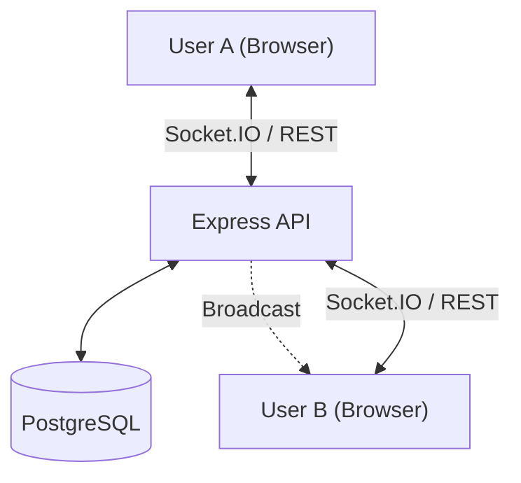

# TaskFlow — Real-Time Task Collaboration Platform

TaskFlow is a modern, production-ready project management application that combines the simplicity of Trello with the power of real-time collaboration. It features a high-performance Express/PostgreSQL backend and a sleek, responsive React frontend.

## 🚀 Key Features

- **Real-Time Collaboration**: Instant synchronization of tasks, lists, and activity across all connected users via Socket.IO.
- **Interactive Kanban Board**: Intuitive drag-and-drop interface for managing task workflows.
- **Rich Task Management**: Detailed task modals with markdown descriptions, priority levels, due dates, and assignee management.
- **Activity Stream**: A live audit log of all board actions, keeping teams in sync.
- **Granular Permissions**: Secure access control where only creators or board owners can perform sensitive actions like deletions.
- **Optimized Performance**: Fast, state-driven UI with optimistic updates for a seamless experience.
- **Modern Aesthetics**: A premium, responsive design with a unified professional color scheme (#3A9AFF).

## 🏗️ Architecture

TaskFlow follows a decoupled client-server architecture designed for scale and real-time responsiveness.

### System Overview
- **Frontend (SPA)**: A React-based Single Page Application using **Zustand** for global state management. It implements **optimistic updates** to ensure immediate visual feedback, with background synchronization to the server.
- **Backend (API)**: A stateless **Express.js** REST API. It uses **Prisma ORM** for type-safe PostgreSQL interactions and **Socket.IO** for event-driven real-time broadcasting.
- **Real-Time Layer**: When a user performs an action (e.g., moving a task), the server processes the database change and then broadcasts an event via Socket.IO to all other members joined in that specific board room.



## �️ Tech Stack

| Component | Technology |
|---|---|
| **Frontend Framework** | React 18.3 + Vite |
| **Styling** | Tailwind CSS v4 |
| **State Management** | Zustand |
| **Real-time** | Socket.IO Client |
| **Animations** | Framer Motion |
| **Database** | PostgreSQL |
| **ORM** | Prisma |
| **Backend API** | Node.js + Express |
| **Validation** | Zod |

## 📡 API Documentation

The backend provides a comprehensive RESTful API for all resources.

### 🔐 Authentication
| Method | Endpoint | Description |
|---|---|---|
| POST | `/api/auth/signup` | Register a new user |
| POST | `/api/auth/login` | Login and receive JWT |
| PUT | `/api/auth/profile` | Update user profile details |
| PUT | `/api/auth/password` | Change authenticated user password |

### 📋 Boards & Members
| Method | Endpoint | Description |
|---|---|---|
| GET | `/api/boards` | List user's boards (paginated) |
| POST | `/api/boards` | Create a new project board |
| GET | `/api/boards/:id` | Get full board state (lists + tasks) |
| PUT | `/api/boards/:id` | Update board name/description |
| DELETE | `/api/boards/:id` | Permanent board deletion (Owner only) |
| POST | `/api/boards/:id/members` | Invite a user to a board |

### 📝 Tasks & Comments
| Method | Endpoint | Description |
|---|---|---|
| POST | `/api/lists/:id/tasks` | Create a task in a specific list |
| PUT | `/api/tasks/:id` | Update task details (Title, Desc, Date, Priority) |
| PUT | `/api/tasks/:id/move` | Move task across lists or change order |
| POST | `/api/tasks/:id/assign` | Assign a user to a task |
| POST | `/api/tasks/:id/comments` | Add a comment to a task |

## 📂 Technical Documentation

For a deeper look into the platform's design and internals, explore the following guides:

- [**Frontend Architecture**](docs/frontend-architecture.md): Store management, optimistic UI, and component patterns.
- [**Backend Architecture**](docs/backend-architecture.md): Service-Controller patterns, middleware, and project structure.
- [**Database Schema**](docs/database-schema.md): ER diagrams and detailed model descriptions.
- [**API Contract Design**](docs/api-contract.md): Request validation, response envelopes, and error handling.
- [**Real-time Sync Strategy**](docs/real-time-sync.md): Socket.IO rooms, event broadcasting, and conflict resolution.
- [**Scalability Considerations**](docs/scalability.md): Horizontal scaling, database optimization, and caching.

## ⚖️ Assumptions & Trade-offs

### 1. Optimistic Updates vs. Absolute Consistency
- **Trade-off**: The UI updates immediately before the server confirms the change.
- **Decision**: We prioritized **UI responsiveness**. To handle errors, the store includes rollback logic that restores the previous state if the API request fails.

### 2. Stateless JWT Authentication
- **Assumption**: A strictly stateless JWT approach is used for simplicity and performance.
- **Trade-off**: While performance is excellent, immediate token revocation (e.g., global logout) requires additional blacklist logic which is currently out of scope for the MVP.

### 3. PostgreSQL Relational Model
- **Decision**: PostgreSQL was chosen over NoSQL to handle the complex graph of relationships (Users -> Teams -> Boards -> Lists -> Tasks) with transactional integrity.

## 👥 Demo Credentials

Explore the platform using these pre-configured accounts:

| User | Email | Password |
|---|---|---|
| **Sarah Chen** | `sarah@example.com` | `Test@123` |
| **Alex Rivera** | `alex@example.com` | `Test@123` |

## ⚙️ Getting Started

### Prerequisites
- [Node.js](https://nodejs.org/) (v18 or higher)
- [PostgreSQL](https://www.postgresql.org/) (v14 or higher)

### 1. Backend Setup
1.  **Install Dependencies**:
    ```bash
    cd backend && npm install
    ```
2.  **Environment**: `cp .env.example .env` and update `DATABASE_URL`.
3.  **Database**:
    ```bash
    npx prisma migrate dev --name init
    npx prisma db seed
    ```
4.  **Launch**: `npm run dev` (Runs on port 5000)

### 2. Frontend Setup
1.  **Install Dependencies**:
    ```bash
    npm install
    ```
2.  **Launch**: `npm run dev` (Runs on port 5173)

## 🐳 Running with Docker

You can run the entire platform (Frontend, Backend, and PostgreSQL) with a single command using Docker Compose.

1.  **Prerequisites**: Ensure you have [Docker](https://www.docker.com/) and [Docker Compose](https://docs.docker.com/compose/) installed.
2.  **Start Services**:
    ```bash
    docker-compose up --build
    ```
3.  **Access**:
    - **Frontend**: `http://localhost:80`
    - **Backend**: `http://localhost:5000`
4.  **Seed Data**: (Optional) To populate the Docker database with sample data:
    ```bash
    docker exec -it taskflow-backend npx prisma db seed
    ```

---

*Built with passion for high-performance team collaboration.*