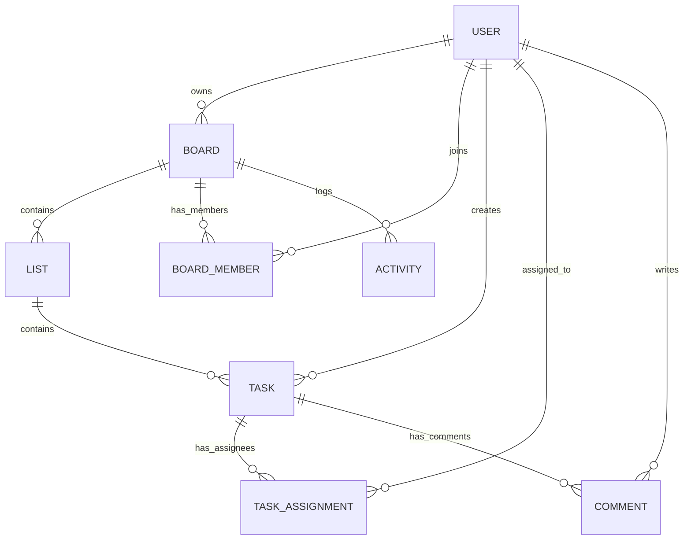

# Database Schema

TaskFlow uses a highly relational **PostgreSQL** schema to maintain data integrity and support complex collaboration features. The schema is managed via **Prisma ORM**.

## 📊 Entity Relationship Diagram

### Visual Schema Design

## 📋 Key Models

### 1. User
Stores essential profile data and links users to their owned boards, board memberships, and task assignments.
- **Fields**: `id`, `email`, `username`, `passwordHash`.
- **Relations**: Owned Boards, Member of Boards, Assigned Tasks, Comments.

### 2. Board
The primary container for collaboration.
- **Fields**: `id`, `name`, `description`, `color`.
- **Relations**: Owner (User), Members (BoardMember), Lists, Activities.

### 3. BoardMember
A join table representing users within a board.
- **Fields**: `id`, `boardId`, `userId`, `role` (owner | member), `joinedAt`.
- **Indexes**: Unique constraint on `[boardId, userId]` for membership integrity.

### 4. List
Represents kanban columns (e.g., "To Do", "In Progress").
- **Fields**: `id`, `name`, `boardId`, `position` (order).
- **Relations**: Board, Tasks.

### 5. Task
The core unit of work.
- **Fields**: `id`, `title`, `description`, `listId`, `position`, `priority` (low | medium | high), `status` (active | completed), `dueDate`.
- **Relations**: List, Creator (User), Assignees (TaskAssignment), Comments.

### 6. Activity
A persistent log of all significant board events.
- **Fields**: `id`, `boardId`, `userId`, `actionType` (created, updated, deleted, etc.), `entityType` (task, list, etc.), `metadata` (JSON).

---
*Back to [README.md](../README.md)*
